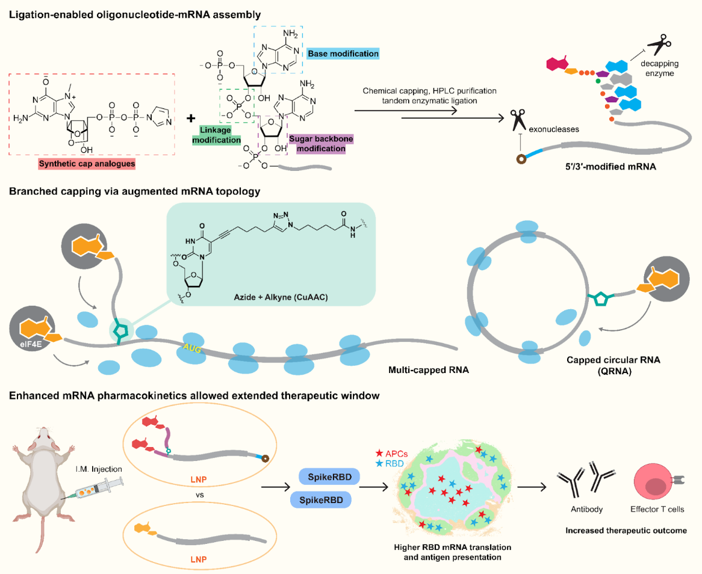

# Multi-capped mRNA



This repository contains scripts for the '**Chemical and topological design of multi-capped mRNA and capped circular RNA for translation augmentation**'. 

1. ```code``` (cell type classification, visualization)
2. ```documents``` (python environment, gene annotation dataframe)

To reproduce the figures in the article, please create a python environment using ```documents/environment.yaml```. 
***

### Other Info

#### Citation

Please cite our paper if you find our work useful: 
TBA
<!-- > [Zeng, H., Huang, J., Ren, J., Wang, C.K., Tang, Z., Zhou, H., Zhou, Y., Shi, H., Aditham, A., Sui, X. and Chen, H., 2023. Spatially resolved single-cell translatomics at molecular resolution. *Science*, *380*(6652), p.eadd3067.](https://www.science.org/doi/10.1126/science.add3067) -->

#### Related Dataset 
[](https://doi.org/10.5281/zenodo.12518588)

***Please use the most recent version of the dataset.***

#### Contact
Contact us at jiahao@broadinstitute.org if you have any issues. 

#### Contributor
Jiahao Huang, Kamal Maher, Hongyu Chen
